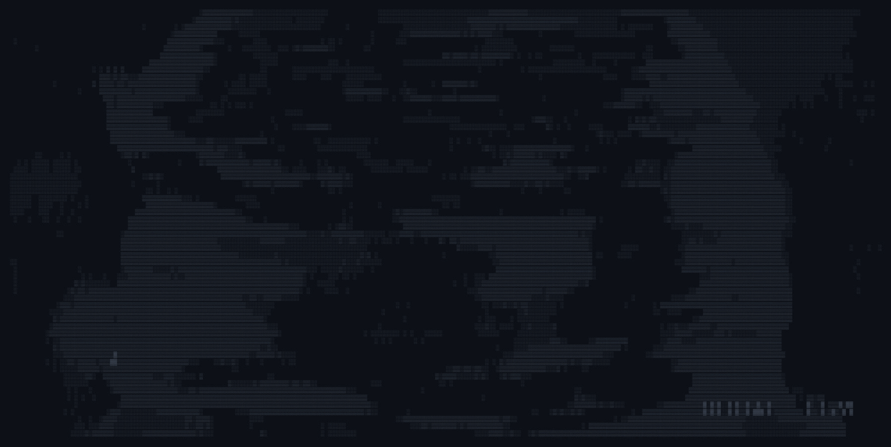

# 0xMrStolass | Cybersecurity & Infrastructure 🛡️

  
  
  
🚀 <b>Estudante de Cibersegurança | Red & Blue Team Enthusiast</b>

  
<i>"Diligence in the morning, security in the night."</i>

---

### 🖥️ Meu Setup & Foco
- 💻 **OS Principal:** **Zorin OS** (Estabilidade para labs de Sec & Dev)
- 🛡️ **Foco Atual:** SOC Operations, SIEM (Elastic Stack) e Redes (CCNA)
- 🈯 **Cultura & Idiomas:** Prática diária de escrita em **Mandarim**, Japonês e Coreano.
- ⚙️ **Dev:** Automação com Python/Shell e manutenção de sistemas legados em Hack.

---

### 🛠️ Tecnologias & Ferramentas

  
  
  
  
  
  

---

### 📊 Estatísticas

  
  
  

---

  
<b>Visualizações do Perfil:</b>

  

---

  

