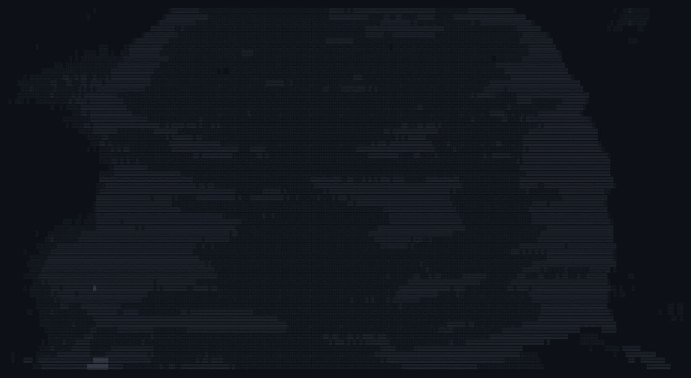

  
  
  <h3>🛡️ Cybersecurity Student | Red & Blue Team Enthusiast</h3>
  
<i>"Diligence in the morning, security in the night."</i>

  

 

  

 

    

      <samp><b>📂 [ SYSTEM_INFO ]</b></samp>
    

     
    

      <ul>
        <li>💻 <b>OS Principal:</b> Zorin OS (Stability & Security)</li>
        <li>🛡️ <b>Foco:</b> SOC Operations, SIEM (Elastic Stack) & CCNA</li>
        <li>🈯 <b>Idiomas:</b> Prática diária de Mandarim, Japonês e Coreano</li>
        <li>⚙️ <b>Dev:</b> Automação Python/Shell & Legacy Systems (Hack)</li>
      </ul>
    

 

<h2 align="center">🛠️ Tech Stack & Tools</h2>

  

 

<h2 align="center">📊 Terminal Stats</h2>

  <table>
    <tr>
      <td align="center"></td>
      <td align="center"></td>
    </tr>
    <tr>
      <td colspan="2" align="center"></td>
    </tr>
  </table>

 

<h2 align="center">🌐 Connect with me</h2>

  
  

 
 

